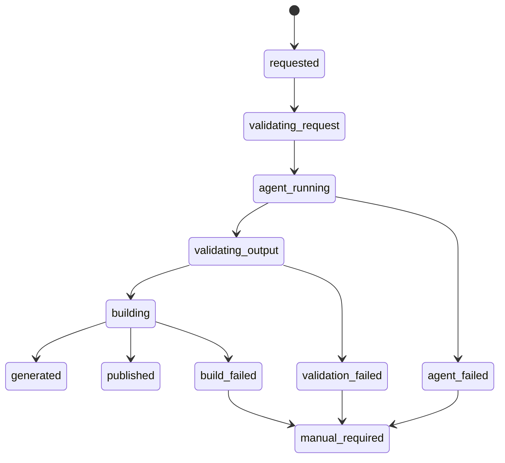

# Development Spec And Architecture

이 문서는 현재 repo의 개발 스펙을 PRD 기준으로 확인하고, 구현 구조를 한눈에 볼 수 있도록 정리한 전체 구조도다.

## 결론

현재 구조는 PRD의 핵심 방향과 일치한다.

```text
request JSON
-> Goose recipe 또는 local generator
-> constrained template generator
-> generated-sites/{company_id}/
-> validation harness
-> npm run build
-> generation-result.json
-> generated 또는 manual_required
```

이 프로젝트는 고객용 AI 채팅 빌더가 아니다. 고객 입력 완료 뒤 내부 담당자가 하던 홈페이지 제작 업무를 Goose 기반 Coding Agent와 Harness로 자동화하는 시스템이다.

사람 승인 단계는 만들지 않는다. 자동 validation/build를 통과하면 `generated` 또는 `published`로 기록하고, 실패하면 retry 후 `manual_required`로 넘긴다.

## 전체 구조도

```mermaid
flowchart TD
  A[Customer STEP completed] --> B[Homepage request JSON]
  B --> C[Homepage generation job]
  C --> D[scripts/run-homepage-builder.sh]
  D --> E[scripts/validate-request.mjs]
  E --> F{GOOSE_MODE}
  F -->|required or auto with Goose| G[Goose recipe]
  F -->|local or Goose unavailable in auto| H[Local deterministic generator]
  G --> I[scripts/generate-static-site.mjs]
  H --> I
  I --> J[templates/company_intro_basic or product_basic]
  J --> K[generated-sites/{company_id}]
  K --> L[harness generated-site validation]
  L --> M[npm run build]
  M --> N[scripts/update-generation-result.mjs]
  N --> O{final status}
  O -->|passed| P[generated or published]
  O -->|retry exhausted| Q[manual_required]
```

## 주요 모듈 책임

| 영역 | 경로 | 책임 |
| --- | --- | --- |
| 제품 스펙 | `PRD.md`, `docs/01_project_intent.md` | 고객 입력 이후 내부 제작 자동화라는 범위 고정 |
| 참고 흐름 | `docs/02_reference_images.md`, `docs/pics/` | 기존 입력 STEP과 결과 맥락 이해, 디자인 복제 금지 |
| Harness 전략 | `docs/03_harness_strategy.md`, `harness/validation-rules.md` | 승인 없는 자동 생성의 검증 기준 정의 |
| 실행 진입점 | `scripts/run-homepage-builder.sh` | request 검증, Goose/local 실행, retry, build, final result 갱신 |
| Goose 실행 | `recipes/homepage-builder.recipe.yaml`, `prompts/goose_homepage_builder.md` | Agent가 지켜야 할 읽기 순서, 금지사항, 생성 계약 정의 |
| deterministic generator | `scripts/generate-static-site.mjs` | request 기반 파일 생성, template 선택, output 격리 |
| 템플릿 | `templates/company_intro_basic/`, `templates/product_basic/` | 자유 디자인 방지, 허용 섹션과 layout control 제한 |
| 스키마 | `schemas/*.json` | request, generation-result, template config 계약 문서화 |
| request 검증 | `scripts/validate-request.mjs` | 필수 필드, enum, company_id path safety, fixed draft controls 검증 |
| output 검증 | `harness/validators/validate-generated-site.mjs` | 필수 파일, template compliance, no fake claims, request-bound content 검증 |
| report 갱신 | `scripts/update-generation-result.mjs` | `generation-result.json`, `agent-run-report.*` 최종 상태 기록 |
| preview app | `frontend/` | 생성 결과 목록, 테스트 입력 화면, `/homepage/{company_id}` preview |
| batch queue | `jobs/`, `scripts/run-pending-homepage-jobs.mjs` | pending job 처리, completed/failed 이동, batch report 생성 |

## 데이터 계약

### Input: homepage request

필수 필드는 다음이다.

```text
request_id
company_id
homepage_type
company_name
industry
business_type
main_business_description
```

`homepage_type`은 `company_intro` 또는 `product`만 허용한다.

선택 필드는 `one_line_intro`, `company_intro`, `core_strengths`, `products`, `portfolio`, `history`, `preferred_style`, draft control 필드 등이다. 생성기는 request에 있는 사실만 사용할 수 있다.

### Output: generated site

회사별 산출물은 반드시 아래에 격리된다.

```text
generated-sites/{company_id}/
```

현재 필수 산출물은 다음이다.

```text
content.json
assets.json
metadata.json
page.tsx
index.html
styles.css
generation-result.json
validation-report.json
agent-run-report.json
agent-run-report.md
```

PRD 필수 파일보다 실제 구현이 더 많은 운영/preview 파일을 생성한다. 이는 정적 확인과 실행 telemetry를 위해 추가된 형태다.

## Template 선택 규칙

```text
homepage_type=company_intro -> company_intro_basic
homepage_type=product        -> product_basic
```

`company_intro_basic` 필수 섹션:

```text
hero
company_intro
core_strengths
contact_cta
```

`product_basic` 필수 섹션:

```text
hero
company_intro
core_strengths
product_area 또는 product_registration_cta
contact_cta
```

상품 정보가 없으면 상품 카드를 만들지 않고 `product_registration_cta`를 생성한다. 연혁, 포트폴리오, 상품, 연락처, 태그는 request에 있을 때만 렌더링한다.

## 상태 전이



MVP의 `generation-result.json` terminal status enum은 다음만 허용한다.

```text
generated
published
agent_failed
validation_failed
build_failed
manual_required
```

`ready_for_review`, `approved`, `reviewing`, `review_rejected`는 금지 상태다.

## No Fake Claims 방어선

현재 검증은 단순 금칙어 이상을 수행한다.

- `company_name`은 request와 exact match
- `one_line_intro`, `company_intro`, `core_strengths`는 제공 시 request와 exact match
- `products`, `history`, `portfolio`는 request 항목만 허용
- `tags`, `contact`, `cover_image_url`도 request-bound로 검증
- 고위험 문구는 request 근거 없으면 실패
- `products`가 비어 있으면 product card 생성 실패 처리

금지 대표 항목:

```text
업력, 설립연도, 인증, 수상, 고객사, 납품 실적, 매출, 순위, 특허,
입력에 없는 상품, 입력에 없는 연혁, 입력에 없는 포트폴리오
```

## 실행 모드

| 모드 | 의미 |
| --- | --- |
| `GOOSE_MODE=local` | Goose 없이 deterministic generator만 실행 |
| `GOOSE_MODE=auto` | Goose가 있으면 recipe 실행, 없으면 local fallback |
| `GOOSE_MODE=required` | Goose recipe 필수. Goose/Provider 실패 시 실패로 기록 |

Goose recipe 내부에서는 outer runner인 `scripts/run-homepage-builder.sh`를 다시 호출하지 않는다. Goose는 constrained generator를 실행하고 validation을 확인하며, retry와 최종 status 갱신은 outer runner가 담당한다.

## 검증 명령

필수 확인 명령:

```bash
bash scripts/run-homepage-builder.sh requests/sample-company-intro.json
bash scripts/validate-generated-site.sh generated-sites/COMPANY_001 requests/sample-company-intro.json
npm run build
```

Harness 전체 회귀 확인:

```bash
npm run test:harness
```

Goose 설정 확인:

```bash
npm run goose:check
npm run goose:preflight
```

## 현재 확인된 구현 갭

1. JSON Schema와 수동 validator가 이중 관리된다.

`schemas/homepage-request.schema.json`과 `scripts/validate-request.mjs`가 같은 계약을 별도로 들고 있다. 필드가 늘어날수록 drift 위험이 있다. 다음 단계에서는 schema를 source of truth로 삼고 validator가 schema를 실행하는 구조가 좋다.

2. `schemas/template-config.schema.json`이 실제 template config보다 좁다.

실제 template config에는 `editable_slots`, `required_visible_sections`, `allowed_section_layout`, `default_section_layout`, `allowed_content_density`, `default_content_density`가 있다. 현재 schema는 이 필드를 정의하지 않아 template config schema validation을 본격 도입하면 실패할 수 있다.

3. preview route gate가 최종 상태를 강제하지 않는다.

`frontend/app/api/test-generate/route.ts`는 `generated|published`, validation passed, build passed일 때만 preview를 노출한다. 그러나 `/homepage/{companyId}` route 자체는 `content.json`, `metadata.json`, `generation-result.json`만 읽히면 실패 상태도 렌더링할 수 있다. 운영 공개 route라면 route 레벨에서도 status/build/validation gate를 강제해야 한다. 내부 artifact viewer라면 문서와 UI에서 그 성격을 명확히 분리해야 한다.

4. AI 판단 산출물이 아직 명시적이지 않다.

현재 Goose는 안정성을 위해 constrained generator 실행 중심이다. 고도화 시에도 자유 디자인을 열기보다 `site-plan.json`, `copy-evidence.json`, `asset-plan.json`, `repair-plan.json`처럼 schema로 검증 가능한 작은 판단 산출물을 추가하는 방향이 맞다.

5. build 검증은 전체 Next.js app 기준이다.

신뢰도는 높지만 batch job이 늘면 비용이 커질 수 있다. 추후에는 per-site static validation과 full app build를 단계화할 수 있다.

## 다음 작업 권장 순서

1. `template-config.schema.json`을 실제 config 필드와 맞춘다.
2. request/result/template schema를 validator의 source of truth로 통합한다.
3. `/homepage/{companyId}` route에 generated/published + validation/build gate를 추가한다.
4. Goose 실행 시 `site-plan.json` 같은 AI 판단 artifact를 추가하되, template/config/component 경계를 넘지 않게 검증한다.
5. batch runner에서 build 비용을 줄일 수 있는 단계별 검증 전략을 설계한다.

